# Using Pi-WRF To Answer Our Driving Question
The following steps demonstrate how to use the Pi-WRF application to answer our driving question: What types of clothes should I take along for my vacation based on the weather forecast?

## Step 1: Understand the Weather Data Problem Scenario

The first step is to present the weather scenario to the learners and
help them see how it is connected to their daily lives. Helping to make
real world connections is very important in this step and a good
scenario could set the tone. Teachers can use different relevant
real-life examples to help learners make the necessary connections
between weather forecasting and their society.

In this lesson, we are trying to use weather data to make predictions
about the weather for the next XX days in order to be able to decide the
best clothes to prepare and wear during these days.

## Step 2: Brainstorm Question and Set Boundaries

### 2.1 Brainstorm Driving Question**

The next step is to brainstorm the driving question with your learners
and decide the best way you think the question should be answered. By
taking a quick glance at the data, you will be able to determine the
different features or variables that are available to you. There are six
(6) main components of weather including: temperature, atmospheric
pressure, wind, humidity, precipitation, and cloudiness. Together with
your students, you will need to decide which of these components will be
used to answer your research question.

In this lesson, I will be using temperature forecasts to answer my
driving question.

:::{note}
The WRF model that we will be using makes predictions for all
these weather features. However, I suggest using just one feature per
lesson.
:::

### 2.2 Setting Boundaries

#### <u>Decide location:</u>

Before you start using the WRF model to make forecasts, you will need to
decide on a location (also known as domain) you want to explore. Decide
this with your learners and take note of the latitude and longitude of
the location you chose.

In this lesson, I will be making a weather forecast for the City of
Boulder, Colorado with latitude and longitude of 40.0150 and -105.2705
respectively.

#### <u>Decide date and time range:</u>

Next you will need to decide the date and time range you intend to make
a weather forecast for. At the moment, the WRF model can make accurate
weather predictions for 7 to 10 days.

## Step 3: Launch Pi-WRF

### 3.1 <u>Download and install docker on your Raspberry pi</u>

To use this application on your raspberry pi (or computer) you need to
have docker installed. If you haven’t already done so you can install
docker my opening a terminal and running the command below:

curl -sSL https://get.docker.com \| sh

### 3.2 <u>Launch the application</u>

After successfully installing docker, copy and paste the command below
into your terminal.

```
sudo docker run -it --rm --net=host -e DISPLAY -v
\$HOME/.Xauthority:/root/.Xauthority ncar/pi-wrf
```

When you enter the following command and execute it, Docker downloads
the file for you and then launches the application. If you close the
program, Docker will save the “file” so you do not have to download it
the next time you run the application.

## Step 4: Initiate Model

These steps assume you already have the application running on a
Raspberry Pi or local computer running.

### 4.1 <u>Load and import all necessary libraries</u>

Press **Shift + Enter** on your keyboard to run the provided import
statements.

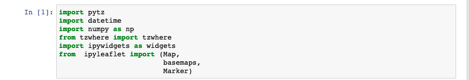

### 4.2 <u>Select Domain</u>

The default domain in the notebook is that of Boulder, Colorado. You can
modify this to your desired location by carrying out either of the
following:

1.  Enter your own preferred domain in the cell box and run it, or

2.  Run the cell as it is, wait till it outputs a map widget and move the blue marker to your desired location.

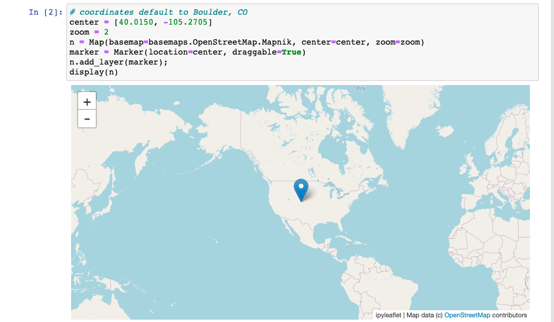

### 4.3 <u>Select Date and Time Range</u>

Modify the start/end dates and start/end times to reflect the decisions
you made in step 2.2 above. The default dates and times in the notebook
are set to your current date and time respectively. Confirm your
selection by pressing **Shift + Enter** on your keyboard.

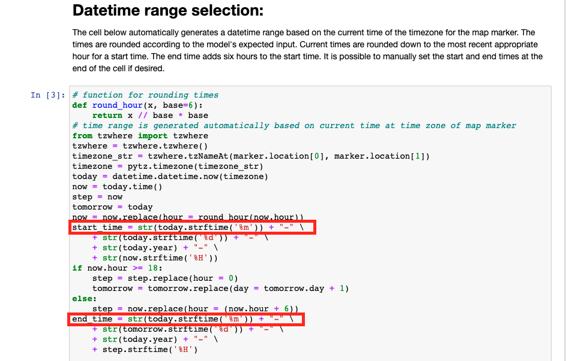

After specifying your start date and end dates, run the cells that
follow till you get to the “Initiate Model” cell.

### 4.4 <u>Run the Model</u>

Now it is time to run the model by running the “Initiate Model” cells.
After the model finishes running it generates various weather conditions
outputs that you can visualize in the steps that follow.

:::{note}
The model might take some minutes while running!
:::
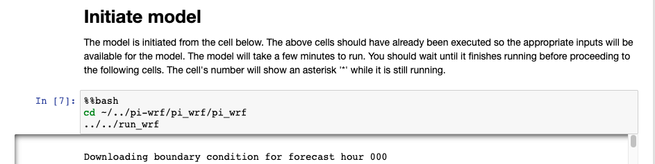

## Step 5: Visualize Model Outputs

These steps assume you already have the application running on a
Raspberry Pi or local computer running. Running WRF in step 3.3 above
outputs different weather graphs/visuals (approximately 7000!) and
stores them in the **\~/../pi-wrf/Output** directory.

You can list the output file names using the terminal command **ls** (this is already entered in the notebook).

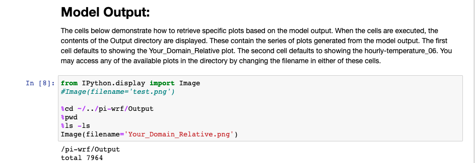

Finally, to visualize any plot of interest, use the image library and
the file name as shown in the code block below:

```
Image(filename='name-of-file.png')
```

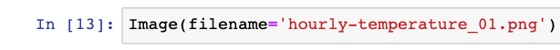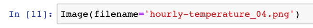

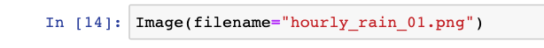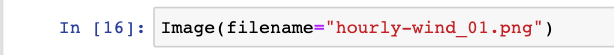

In this lesson, I will be visualizing the hourly temperature plots since
I already decided that I was going to tell my weather story using
temperature forecasts. However, I included a variety of outputs here to provide some clues about the various weather plots WRF can provide.

Sample Outputs:

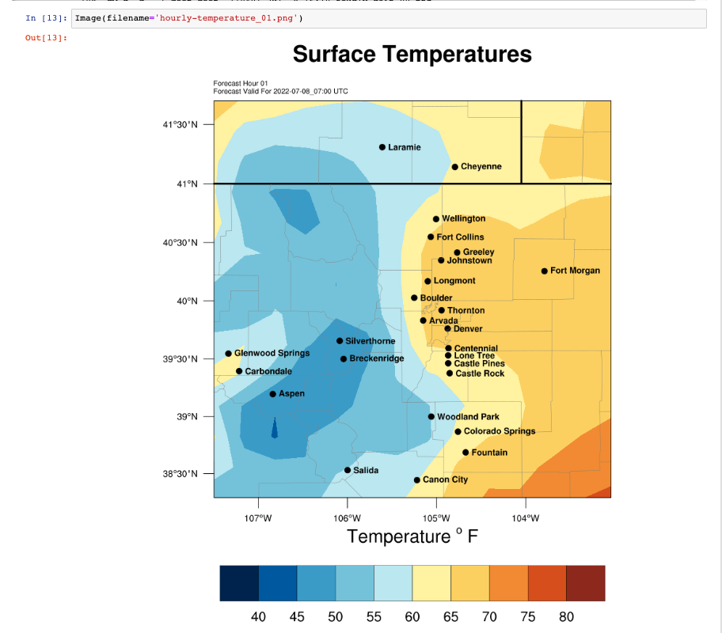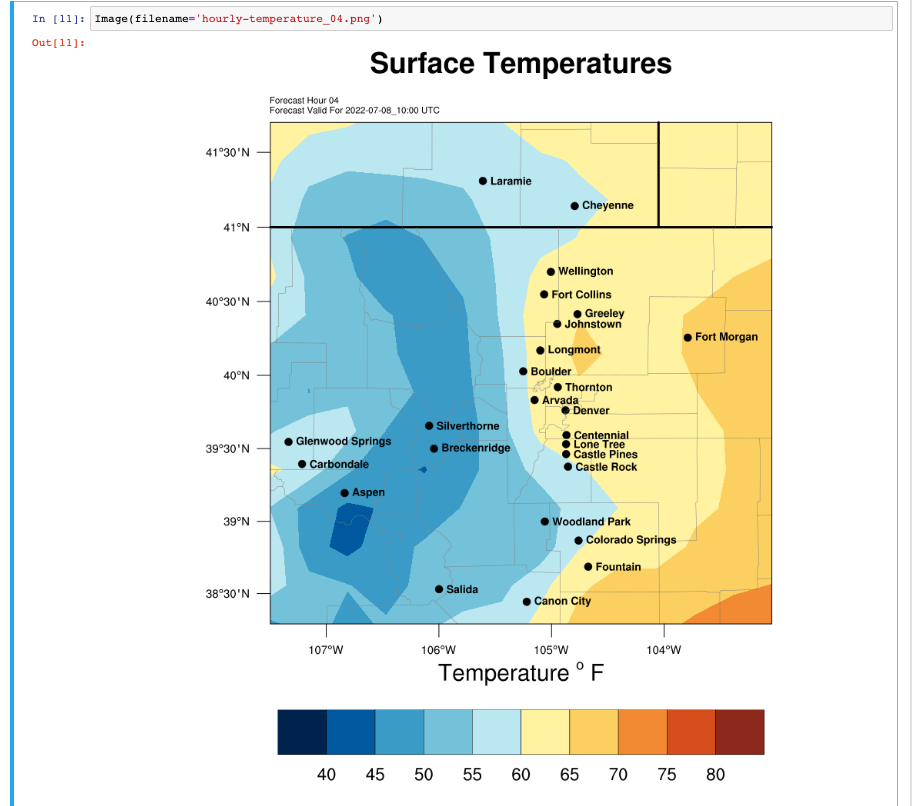

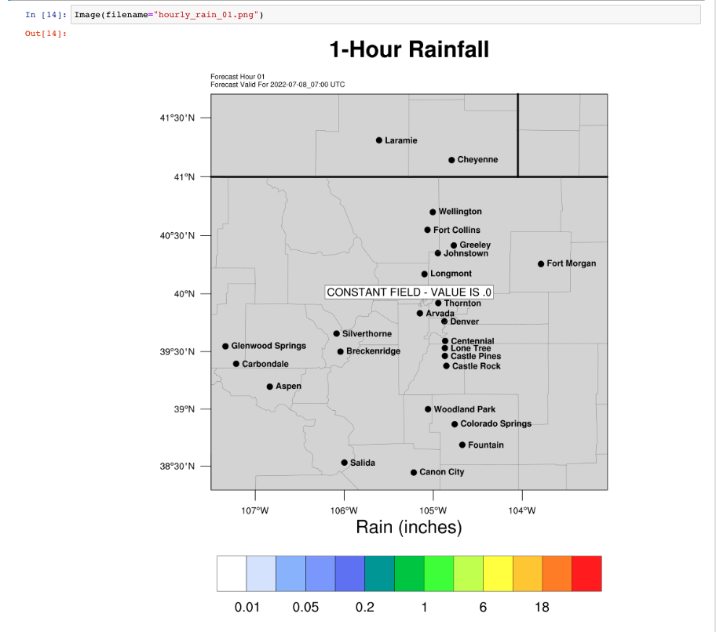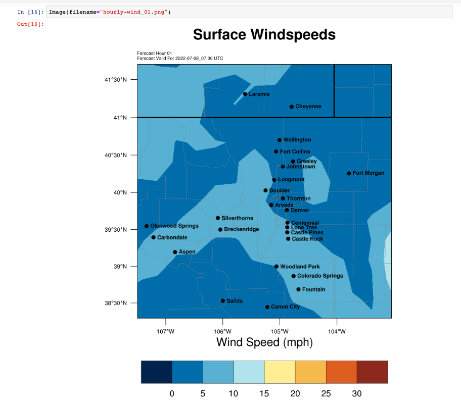

## Step 6: Answer Your Driving Question**

Using your weather plots, you will need to answer your driving question
and decide the types of clothes you will need to make provision for
based on the weather forecasts you just analyzed.

## Step 7: Tell Your Weather Story:**

Now is the time to get creative and tell your weather story! Using your
weather predictions, plots and vacation plans you can now tell a story
about how your vacation plans and clothes were shaped by your
forecasting. Teachers can engage learners in this activity in a variety
of ways. For example, kids could tell a picture story, Draw infographics
or create a video.

In this lesson, I have chosen to tell my weather story using the
infographic below.

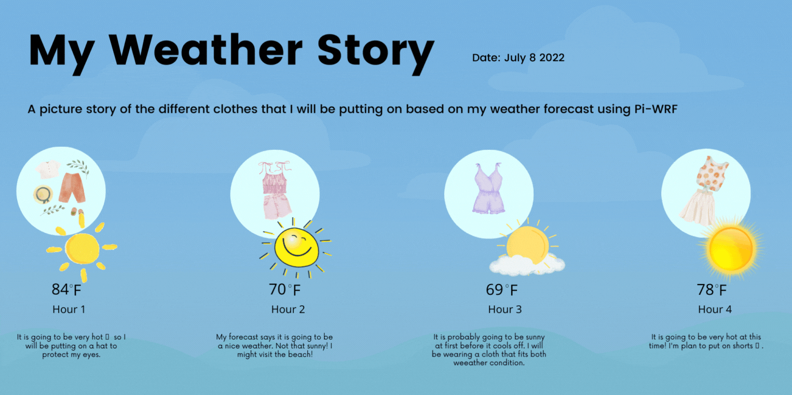

